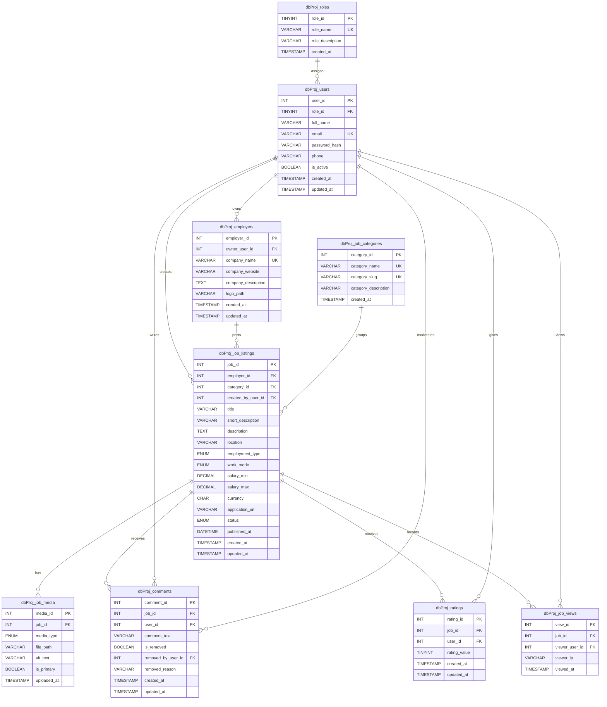

# Job Portal ERD

This ERD is designed for the IT8415 job portal contribution. All tables use the required `dbProj_` prefix.

Screenshot-ready SVG version: [`erd-job-portal.svg`](erd-job-portal.svg)

## Relationship Notes

- `dbProj_roles` supports the required viewer, creator, and administrator roles.
- `dbProj_users.password_hash` stores encrypted password hashes, not plain text passwords.
- `dbProj_job_listings` belongs to one employer, one category, and one creator user.
- `dbProj_comments` supports admin moderation through `is_removed`, `removed_by_user_id`, and `removed_reason`.
- `dbProj_ratings` uses a unique `(job_id, user_id)` rule so one user can rate the same job only once.
- `dbProj_job_views` supports popularity reports by view count.
- `dbProj_job_listings` has a FULLTEXT index on `title` and `description` for engine-based search.
